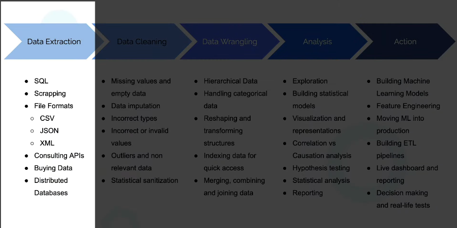

# About this certf

1. What is Data Analysis

> A process of **inspecting, cleansing, transforming** and modeling data with the goal of discovering useful information, informing conclusion and supporting decision-making.

The data analysis process :

2. Real example Data Analysis with Python
3. How to use Jupyter Notebooks
4. Intro to NumPy
5. Intro to Pandas
6. Data Cleaning
7. Reading Data SQL, CSVs, APTs, etc
8. Python in Under 10 Minutes