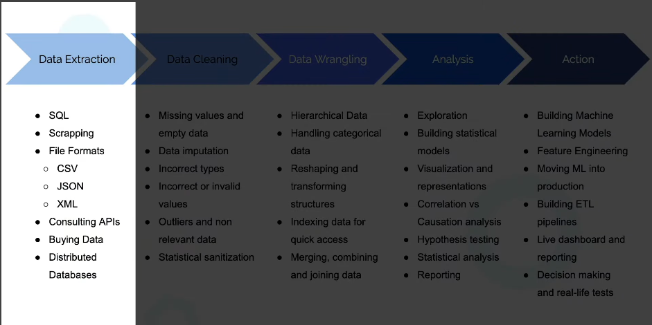

# About this certf

1. What is Data Analysis

> A process of **inspecting, cleansing, transforming** and modeling data with the goal of discovering useful information, informing conclusion and supporting decision-making.

The data analysis process :

2. Real example Data Analysis with 

- Data Analysis Example :
    - *df.head()* by default let us see the first 5 lignes of our dataset
    - *df.shape* tell us how many rows and columns we have
    - *df.info()* to quickly understand the data we are working with, it help us to have a better structure of our data
    - *df.describe()* to have a statistical understanding of our data, it help us to have a quick statistical view of our data
    - *df.corr()* to fastly get the correlation between properties
    - *df.loc[]* to make a selection using rows or columns name

- Notes taked while doing the Exercice 1 :
    - when *.mean()* is applied on the whole dataset it return multiple value for each numerical column
    - there is a multiple way to get a mean of specific column *describe()* and *.mean()* maybe there is another way, i only know these two

    The *.plot* method in pandas can be used to draw multiple type of graph by setting the type with the **kind** parameter :

       - "line" : for temporal evolution
       - "bar" : to compare multiple categories
       - "hist" : for frequency
       - "box" : for quantiles visualization and aberants values
       - "scatter(x, y)" : to get the relation between two variables
       - "kde" : density estimation

    Use it like this :
    - df.plot(kind="hist")
    - df.plot.hist()

    Also *.plot()* his usefull parameter :
    - figsize(width, heigth) : to set the size of the picture 
    - title="" : add a title
    - legend=True/False : hide or display the legend
    - subplots=True : to let pandas create multiple graph for each column
    - color=['gree', 'red', 'yellow'] : to choise your own color

    *.value_counts()* permet de compter le nombre d'apparitions de chaque valeur unique dans une colonne.

3. How to use Jupyter Notebooks
4. Intro to NumPy
5. Intro to Pandas
6. Data Cleaning
7. Reading Data SQL, CSVs, APTs, etc
8. Python in Under 10 Minutes