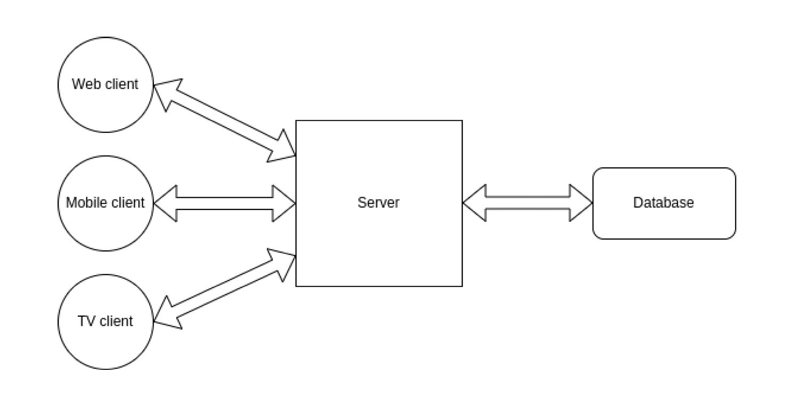

# The Software Architecture Handbook
by German Cocca

## What is software architecture ?

L'architecture logiciel d'un système represente l'ensemble des décision de conception fondamentales qui définissent sa structure organisationnelle, ses comportements dynamiques et ses propriétés non fonctionnelles.

Elle décrit :

- la structure : les composants, leurs reponsabilités, leurs interfaces et les relations qui les relient.

- Le comportement : la maniere dont ces composants interagissent, communiquent et évoluent au cours de l'exécution.

- Les contraintes et qualité : exigences non fonctionnelles notamment 
    * performance
    * sécurité
    * maintenabilité
    * évolutivité
    * fiabilité

- Les choix technologiques et principes directeurs : langages, framework, protocoles, styles architecturaux (microservices, monolithes, couches, evenements, ...)

- Les compromis et justification : Le plus important !!!
pourquoi certaines décisions ont été prises, en tenant compte du contexte, des objectifs et des contraintes.

## Achitecture concepts to know

### C'est quoi le model Client-serveur ?
La chose a retenir ici c'est simplement que le client demande des ressources ou services et le serveur éffectuer toutes les opérations autour pour répondre.

Il est également important de toujours prendre en compte que le client et le serveur peuvent être developé, hebergé et exécuté séparement.

### C'est quoi les APIs ?
On peut dire que c'est un ensemble de regles qui régissent la communication d'applications entre elles.

par exemple l'app X dit a Y que si tu me dit A je vais toujours de repondre B.

Là Y sait exaction quoi dire pour obtenir B de X.

API signifie Application PRogramming Interface :)

Il existe plusieurs chemins par lesquels des API peuvent être conçu. Les plus populaires sont :
- RESt
- SOAP
- GraphQL

### What's modularity ?
La modularité en architecture logiciel c'est la capacité a diviser de grosse chose en petite partie. C'est cette pratique qui permet de rendre les grosses base de code plus maintenanble et comprehensible.

la modularité a beaucoup d'avantage :
- ça donne une bonne organisation et une meilleur visualisation du projet
- chaque module peut être testé séparement ce qui rend le projet plus facile a maintenir et a debuger

### À quoi ressemble ton infrastructure ?
Oui il y'a plusieurs maniere d'organiser notre code et la structure du projet. Mais comment mettons nous en place l'infrastructure deriere notre projet ?

#### Architecture Monolithic

C'est ce qu'on a l'habiture de voir et de construire car il est simple comprendre et très facile à implémenter.

Ici nous avons **un seul serveur** qui reçoit et traite les requetes d'un ou plusieurs clients (web, mobile, TV, etc...).

Le croquis d'une architecture de ce type peut ressembler a ceci :

C'est sa simplicité qui est le plus grand avantage de cette approche. Notons que c'est comme ça que commence la plus part des applications.